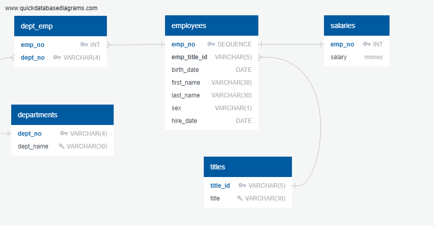

# sql-challenge - Employee Database: A Mystery in Three Parts
Lennox Nguyen's submission on sql-challenge 

# Background
It’s been two weeks since you were hired as a new data engineer at Pewlett Hackard (a fictional company). Your first major task is to do a research project about people whom the company employed during the 1980s and 1990s. All that remains of the employee database from that period are six CSV files.
For this project, you’ll design the tables to hold the data from the CSV files, import the CSV files into a SQL database, and then answer questions about the data. That is, you’ll perform data modeling, data engineering, and data analysis, respectively.

1. Data Engineering

2. Data Analysis

# Data Engineering

# Data Analysis
Data Analysis performed in files:

1. analysis.queries.sql
2. table_schemata.sql
